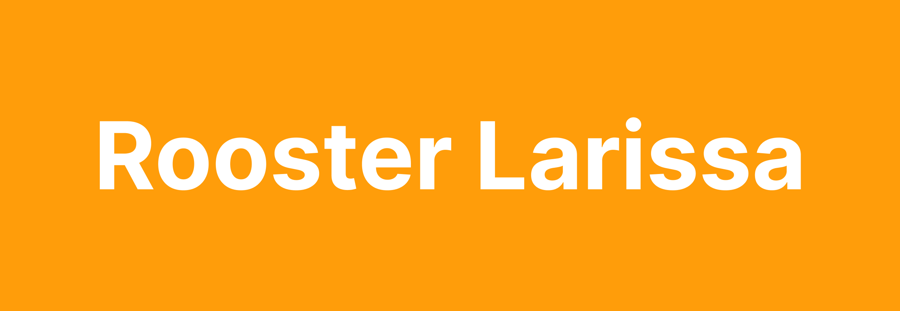

# Rooster Larissa

# Table of contents

-   [User Scenario](#user-scenario)
-   [Exclusive Design Principles](#exclusive-design-principles)
-   [Testverslag](#testverslag)

# User Scenario

Door middel van een user scenario breng ik de identiteit van de testpersoon in kaart. In dit geval is dat dus voor Larisse.

## Over Larissa

Larissa is een Nederlands wielrenster en baanwielrenster die actief is in het para-cycling. Ze ziet momenteel nog maar voor 1%. Ondanks dat is ze een topsporter en heeft ze onlangs een gouden medaille gewonnen. Ze gebruikt een screenreader om te navigeren door websites. Veel websites zijn vanuit een visueel oogpunt ontworpen en werken hierdoor niet optimaal voor haar.

## Haar probleem

Alle topwielrenners krijgen om de zoveel tijd een Excel sheet toegestuurd waarin alle trainingsschema’s staan. De huidige schema's die ze krijgt zijn complex en _colour coded_. Dit zorgt ervoor dat ze deze schema's niet goed kan begrijpen met behulp van de screenreader. Aan mij dus de taak om een oplossing te ontwerpen waardoor Larissa op een prettige en manier haar rooster kan gebruiken.

## De oplossing

De oplossing is dus om een website te ontwerpen die speciaal voor Larissa, maar ook met Larissa is gemaakt. Door dit te doen maak ik een website die zij graag gebruikt (en leuk vindt om te gebruiken). Door dit te doen zorgen we ervoor dat Larissa haar roosters net zo makkelijk kan bekijken als mensen zonder beperking (en misschien wel makkelijker).

# Exclusive Design Principles

In mijn ontwerp heb ik rekening gehouden de Exclusive Design Principles: Study situation, Ignore conventions, Prioritise identity & Add nonsense.

## Study situation

Het eerste principe is 'Study situation''. Dit gaat over het onderzoeken van de individuele situatie van de gebruiker. Dit is belangrijk, omdat we vaak niet genoeg weten over de situatie van mensen met beperkingen en hierdoor verkeerde aannames doen.

In het geval van Larissa hebben we bij de eerste ontmoeting super veel geleerd. We hebben met de groep een vragenlijst opgesteld waar hele waardevolle informatie uit kwam. Alle bevindingen hiervan staan in het testverslag, maar een paar die er uitspringen zijn bijvoorbeeld wat voor device Larissa gebruikt en op welke manier. In het gebruikers scenario stond namelijk dat ze een brailleleesregel gebruikt, maar zelf gaf ze aan dit bijna nooit te doen. Daarom is het dus belangrijk zelf onderzoek te doen.

## Ignore conventions

Het tweede principe 'Ignore conventions' gaat over het loslaten van ontwerp conventies. Er zijn veel design patterns en conventies die we dagelijks gebruiken, maar zijn deze wel allemaal toegankelijk? Dit principe wil dus dat je een tweede keer nadenkt voordat je iets zomaar implementeert.

Ik heb dit toegepast door zo semantisch mogelijke HTML te schrijven en geen patterns over te nemen die niet toegankelijk zijn.

## Prioritise identity

Het derde principe 'Prioritise identity' gaat over het betrekken van de gebruikers met een beperking bij het ontwerpproces. Door ze vanaf het begin te laten testen en meedenken krijg je inzichten die je anders nooit had gekregen.

In dit project heeft dit een grote rol gespeeld, doordat we elke week met Larissa gingen testen. Hierdoor kreeg ik bijvoorbeeld feedback op iets waarvan ik dacht dat het heel logisch was, maar voor haar zorgde het voor verwarring. Dit kun je door middel van dit principe dus voorkomen.

## Add nonsense

Websites kunnen wij naast praktisch als heel mooi, bijzonder of grappig ervaren. Waarom niet voor blinden? Dit laatste principe gaat over het verbeteren van de ervaring op je website voor mensen met een beperking.

In mijn website van Larissa heb ik dit gedaan door op de roosterpagina gifjes toe te voegen die aangeven wat de geselecteerde activiteit op het rooster is. Omdat Larissa nog een heel klein beetje kon zien leek het me leuk om bewegende gifjes erin te doen die opvallen voor haar.

# Testverslag

## Week 1

In de eerste week was de opdracht nog een beetje vaag. We hadden Larissa nog niet ontmoet, wat het lastig maakt om specifiek iets voor haar te maken. Ook hadden we nog geen rooster gezien, dus het was een beetje improviseren.
Ik ben aan de slag gegaan met een website waar zij haar roosters kan uploaden en omzetten in een tabel. Dit leek mij handig zodat ze haar roosters goed met een screen reader kan gaan gebruiken. Ook hebben we samen met iedereen van team Larissa een boel vragen bedacht om meer te weten over Larissa.

### Resulaten

Na de meeting met Larissa bleek de opdracht toch wat anders te liggen. Ze heeft niet per se een rooster die ze moet uploaden, ze wil gewoon een website waarop ze makkelijk per week kunt zien wat ze moet doen. Ook heeft ze veel vragen van ons beantwoord. De bevindingen heb ik hieronder genoteerd.

-   Ze heeft maar 1% visie. Dingen met goed contrast kan ze een klein beetje zien
-   Brailleboord gebruikt ze eigenlijk niet, alleen screenreader
-   De screenreader die ze gebruikt op haar laptop is JAWS en op haar telefoon die van Apple
-   Zorg dat tekst in een groot lettertype staat, met een duidelijk font en een goed kleurcontrast
-   Schema's bekijkt ze het liefst per week
-   Ze wil snel informatie krijgen, ze gebruikt vaak zoekfuncties
-   Ze gebruikt graag `tab` en niet de pijltjestoetsen o.i.d.
-   Ze vind witte kleuren niet altijd fijn, dus liever zwarte achtergrond met witte tekst

## Week 2

In week 2 heb ik de eerste versie van mijn ontwerp afgemaakt. Daarin heb ik rekening gehouden met de wensen van Larissa en de bevindingen die hier boven staan.

### Ontwerp

Hier zie je de homepagina. Zoals je kan zien zijn de letters groot en duidelijk. Ze hebben een goed contrast met de achtergrond en de knoppen. De achtergrond is donker omdat Larissa dat fijn vond.

Je kunt een rooster bekijken door het weeknummer in te vullen. Dit heb ik gedaan omdat Larissa graag snel wil navigeren door de site en het liefst snel iets intypt.

Op de roosterpagina kun je per dag de activiteiten bekijken en terug gaan naar de hoofdpagina. Ook hier is `tabindex` gebruikt zodat ze overal door heen kan tabben.

### Resulaten

Ik dacht overal aan gedacht te hebben, tot ik het met Larissa ging testen. Veel dingen vond ze fijn, maar er waren nog wel wat verbeter punten. Namelijk:

-   Op de `h1` zit geen `tabindex` omdat hij hetzelfde was als de pagina titel. Dit vond ze alleen erg verwarrend, omdat ze ziet dat er iets staat, alleen de screenreader springt er overheen. Ze wil graag weten wat er staat.
-   De focus states zijn nog niet gestyled. De standaard van de browser is niet heel duidelijk.
-   Heel fijn om de week te kunnen invullen, maar het zou nog fijner zijn als verteld wordt welke week het nu is

### Week 3

In week 3 ging ik aan de slag met de feedback van afgelopen week. Dit is de vernieuwde versie geworden:

### Ontwerp

Hier zie je de nieuwe homepagina met een aantal wijzigingen. Allereerst heb ik de heading structuur aangepast. Nu is het simpeler met 1 heading en kan overal op gefocust worden. Ook is de input aangepast. Nu staat er standaard het huidige weeknummer en wordt dit ook verteld in de screenreader. Met behulp van JavaScript heb ik ervoor gezorgd dat er niet per ongeluk meer dan 2 cijfers ingevuld kan worden. Zo kan ze nooit de verkeerde week kiezen. Ook heb ik het gele verandert in oranje om in het thema van het Nederlandse team te blijven en heb ik focus states toegevoegd.

De kleur en focus wijzigingen heb ik ook toegepast op de rooster pagina

### Resulaten

Deze versie was bijna perfect. Alles werkt goed en is duidelijk. Wel kunnen er nog tijden toegevoegd worden aan de roosterpagina om meer detail te geven. Ook wilde ik nog wat nonsense toevoegen in de vorm van gifjes die veranderen met de focus state van het rooster. Dit heb ik in de laatste versie gedaan:

### Laatste aanpassingen

# License

MIT
